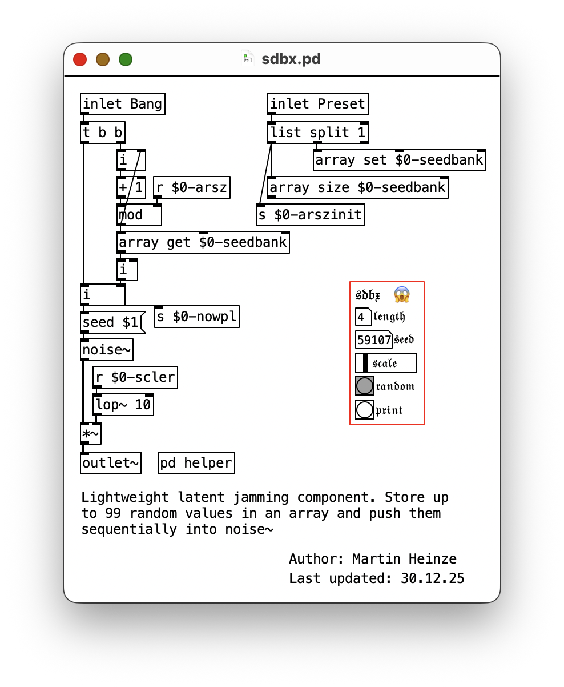
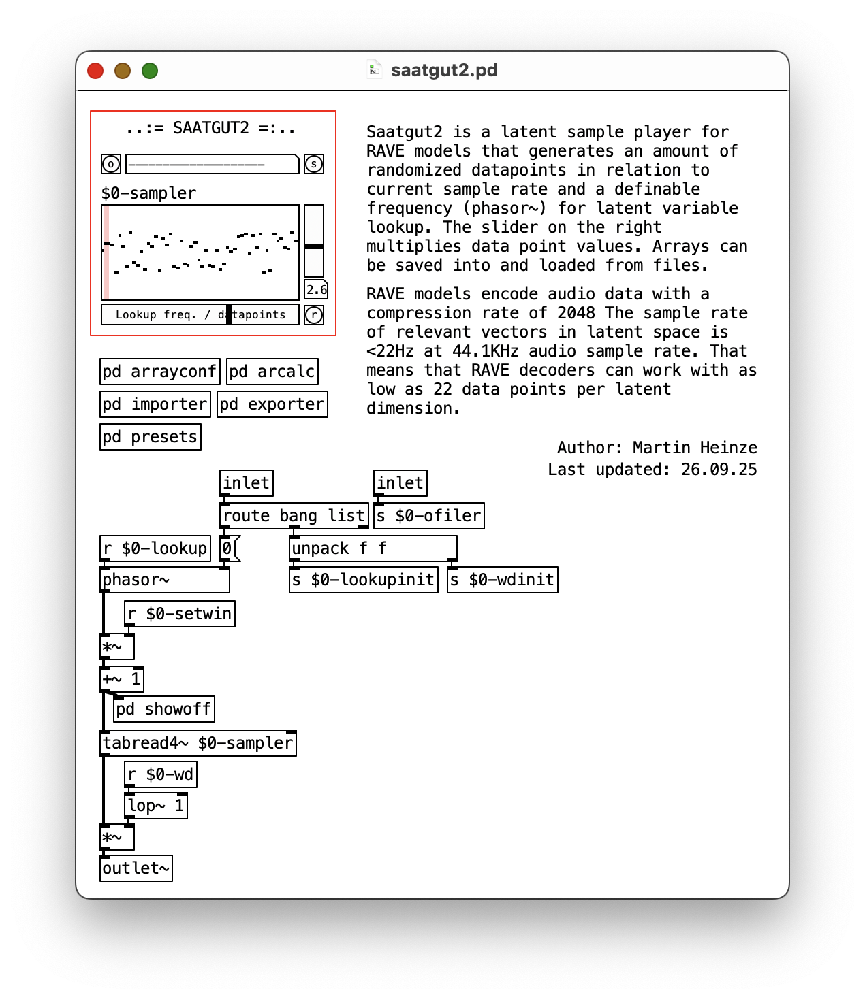

# PD-latent-jamming
This repository contains abstractions written in Pure Data that mimick latent embeddings for use in generative neural audio synthesis. \
\
**Latent Jamming** is an improvisation practice with real-time capable neural audio models that embraces concepts of algorithmic and/ or generative composition techniques. Read more about concept and practice [here](https://martstil.de/concepts/latent-jamming). \
\
Compatible model architectures include [RAVE](https://github.com/acids-ircam/RAVE), [VSCHAOS2](https://github.com/acids-ircam/vschaos2), [MSPrior](https://github.com/caillonantoine/msprior) and [AFTER](https://github.com/acids-ircam/AFTER)) all of which can be loaded using [nn~](https://github.com/acids-ircam/nn_tilde).

*Latest version:* v0.4.1

## Abstractions
### sdbx
 \
Lightweight component that stores up to 99 random values in an array and pushes them sequentially into a noise~ object each time a bang comes in through the first inlet. 
### saatR
 \
saatR generates random noise sample patterns based on predefined seeds. These patterns can be restarted via bangs to the first inlet. *Range* slider multiplies sample values, *Offset* slider shifts window of values. The pattern can be modulated by an external signal source via the second inlet (switch on Mod. toggle). The *seedR* addon can be used to switch between two pre-set seed values injected into the third inlet of the abstraction.  
### Saatgut, Saatgut2
 \
Saatgut is a latent sample player that generates arrays (64-512 datapoints) with randomized values and employs signal input for lookup (e.g. phasor~ for loops). The slider on the right multiplies data point values. Arrays can be saved into and loaded from files. \
 \
Saatgut2 is a potentially cheaper version of Saatgut that replaces fixed with relative amounts of randomized datapoints in relation to current sample rate and a definable frequency (phasor~) for latent variable lookup.
### arseq
\
Arseq is a prototype abstraction for latent sequencing. It generates a small array (1-16 datapoints) with manually set values and outputs these consecutively as signals on each bang received through the first inlet either as constants or with a simple envelope applied (decay to 0).
### Lateefah
\
Lateefah is a family of multichannel signal generators with storage banks that conserves offset constellations for latent dimensions (think: sound presets). The *Modulator* addons semi-automatically goes through the vicinity of the values stored in order to create organically moving sound shifts.
### Bender
\
Bender is inspired by [Błażej Kotowski's work](https://github.com/blazejkotowski) with his fork of nn~ ([nn~ bending](https://github.com/blazejkotowski/nn_tilde_bending)).
The component exposes the neural net's weights and biases and can be used to tamper with the model e.g. manually overwrite, shift or randomize a given percentage of datapoints in the neural nets layers. The abstraction comes with additional controls for [MSPrior](https://github.com/caillonantoine/msprior) and [AFTER](https://github.com/acids-ircam/AFTER) models.
## License
<a href="https://github.com/devstermarts/PD-latent-jamming">PD-latent-jamming</a> © 2025 by <a href="https://github.com/devstermarts">Martin Heinze</a> is licensed under <a href="https://creativecommons.org/licenses/by-sa/4.0/">CC BY-SA 4.0</a>
