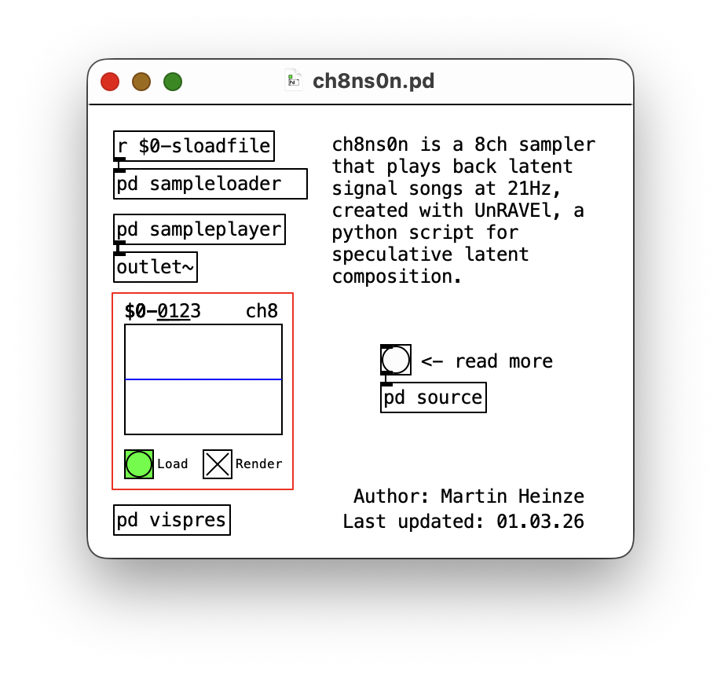

# PD-Latent-Jamming
This repository contains abstractions written in Pure Data that mimick latent embeddings for use in generative neural audio synthesis. \
\
**Latent Jamming** is an improvisation practice with real-time capable neural audio models that embraces concepts of algorithmic and/ or generative composition techniques. Read more about concept and practice [here](https://martstil.de/concepts/latent-jamming). \
\
Compatible model architectures include [RAVE](https://github.com/acids-ircam/RAVE), [VSCHAOS2](https://github.com/acids-ircam/vschaos2), [MSPrior](https://github.com/caillonantoine/msprior) and [AFTER](https://github.com/acids-ircam/AFTER)) all of which can be loaded using [nn~](https://github.com/acids-ircam/nn_tilde).

*Latest version:* v0.5.0

## Abstractions

| Component | Description |
|-------|-------------|
|  | **Arseq** is a prototype abstraction for latent sequencing. It generates a small array (1-16 data points) with manually set values and outputs these consecutively as constant signals or with a simple envelope applied (decay to 0) on each bang received through the first inlet. |
|  | **Bender** is inspired by [Błażej Kotowski's work](https://github.com/blazejkotowski) with his fork of nn~ ([nn~ bending](https://github.com/blazejkotowski/nn_tilde_bending)). The component exposes the neural net's weights and biases and can be used to tamper with the model e.g. manually overwrite, shift or randomize a given percentage of data points in the neural nets' layers. The abstraction comes with additional controls for [MSPrior](https://github.com/caillonantoine/msprior) and [AFTER](https://github.com/acids-ircam/AFTER) models. |
|  | **ch4ns0n and ch8ns0n** are POC components for latent composition use case. They are 4ch/ 8ch samplers that play back latent signal songs at 21Hz, created with [UnRAVEl](https://github.com/devstermarts/UnRAVEl), a python script for speculative composition in latent space. |
|  | **Lateefah** is a family of multichannel signal generators with storage banks that conserve offset constellations for latent dimensions (think: sound presets). The **modulator** addons semi-automatically go through the vicinity of the values stored in order to create organically moving sound shifts. |
|  | **Saatgut**  is a latent sample player that generates arrays (64-512 data points) with randomized values and employs signal input for lookup (e.g. phasor~ for loops). The slider on the right multiplies data point values. Arrays can be saved into and loaded from files. |
|  | **Saatgut2** is a potentially cheaper version of Saatgut that replaces fixed with relative amounts of randomized data points in relation to current sample rate and a definable frequency (phasor~) for latent variable lookup. |
|  | **saatR** generates random noise sample patterns based on predefined seeds. These patterns can be restarted via bangs to the first inlet. *Range* slider multiplies sample values, *Offset* slider shifts window of values. The pattern can be modulated by an external signal source via the second inlet (switch on Mod. toggle). The **seedR** addon can be used to switch between two pre-set seed values injected into the third inlet of the abstraction. |
|  | **sdbx** is a lightweight component that stores up to 99 random seed values in an array and pushes them sequentially into a noise~ object each time a bang comes in through the first inlet. |

---

## License
<a href="https://github.com/devstermarts/PD-Latent-Jamming">PD-Latent-Jamming</a> © 2026 by <a href="https://github.com/devstermarts">Martin Heinze</a> is licensed under <a href="https://creativecommons.org/licenses/by-sa/4.0/">CC BY-SA 4.0</a>
